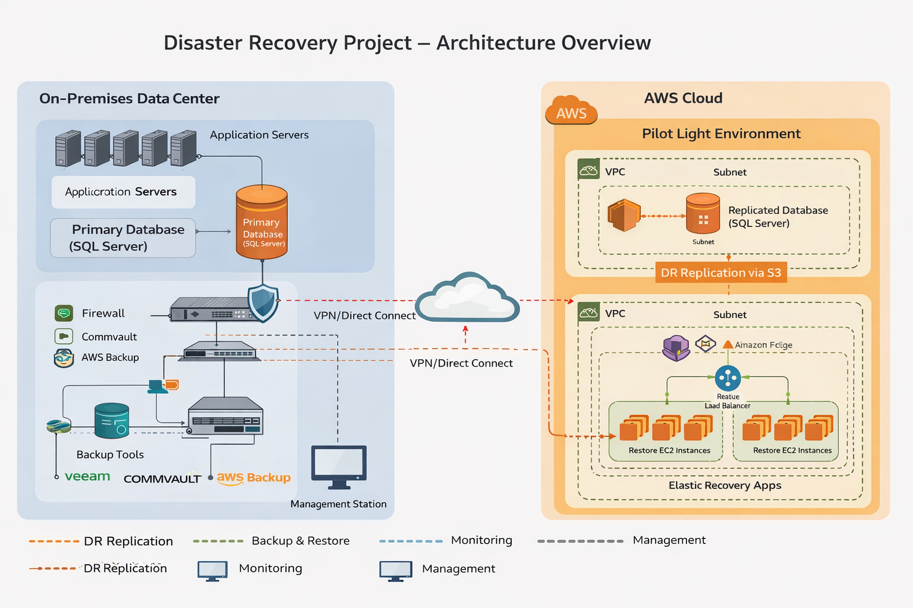

# Disaster Recovery Solution – Dual Infotech Group

## 📌 Project Overview

This project focused on designing and implementing a disaster recovery solution for Dual Infotech Group (Client: Elango) using Amazon Web Services. The goal was to ensure business continuity, data protection, and minimal downtime during system failures or outages.

---

## 👨‍💻 Role

Cloud Engineer

## ⏱ Duration

3 Months

## 🏢 Client

Dual Infotech Group (Client: Elango)

---

## 🛠️ Technologies Used

* Amazon EC2
* Amazon S3
* AWS Backup
* Amazon Route 53
* Amazon CloudWatch
* IAM
* Multi Availability Zone Deployment

---

## 🧠 Architecture

Primary Server → Backup Server (EC2)
Database Backup → Amazon S3
Automated Backup → AWS Backup
DNS Failover → Route 53
Monitoring → CloudWatch

  

---

## ⚙️ Implementation Steps

1. Created backup EC2 instances in different availability zones.
2. Stored backup data in Amazon S3 for durability and availability.
3. Configured AWS Backup for automated backup scheduling.
4. Implemented Route 53 DNS failover for automatic traffic redirection during failures.
5. Configured CloudWatch monitoring and alerts.
6. Tested backup and recovery procedures.
7. Verified failover functionality and system recovery time.

---

## 🚀 Key Features

* Automated backup system
* DNS failover mechanism
* Multi-zone high availability
* Secure data backup and recovery
* Monitoring and alert system
* Business continuity solution

---

## 🎯 Outcome

Successfully implemented a disaster recovery system that ensured data protection, reduced downtime, and improved system reliability during failures.

---

## 📁 Folder Structure

Disaster-Recovery-AWS/
│
├── README.md
├── architecture/
├── screenshots/
